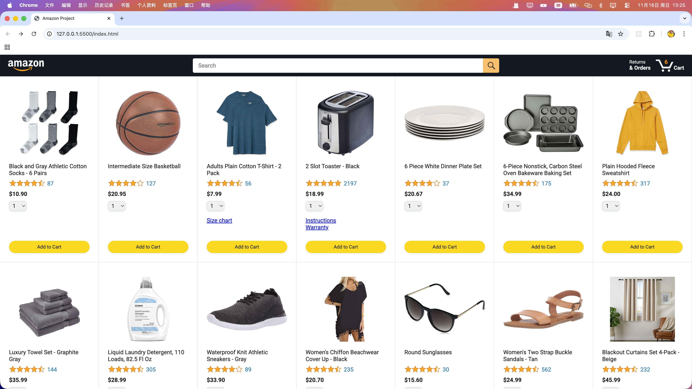
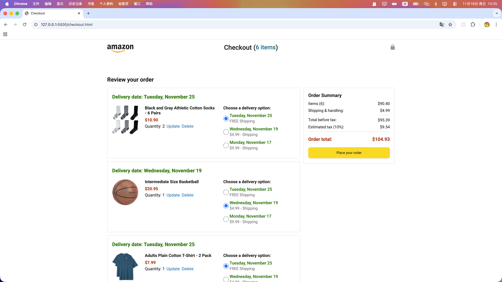
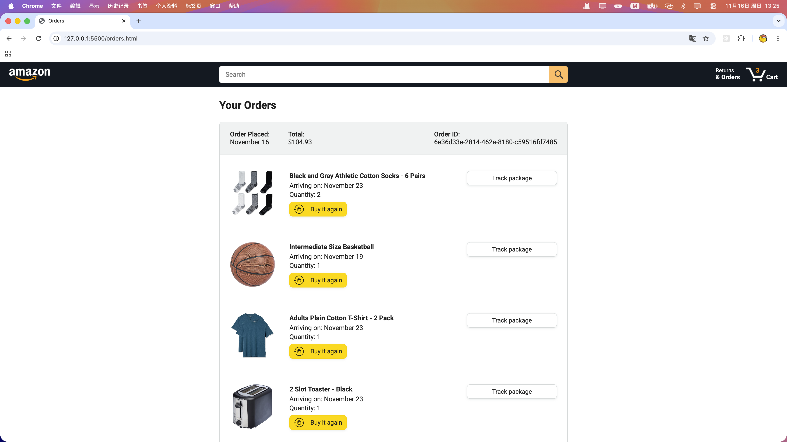
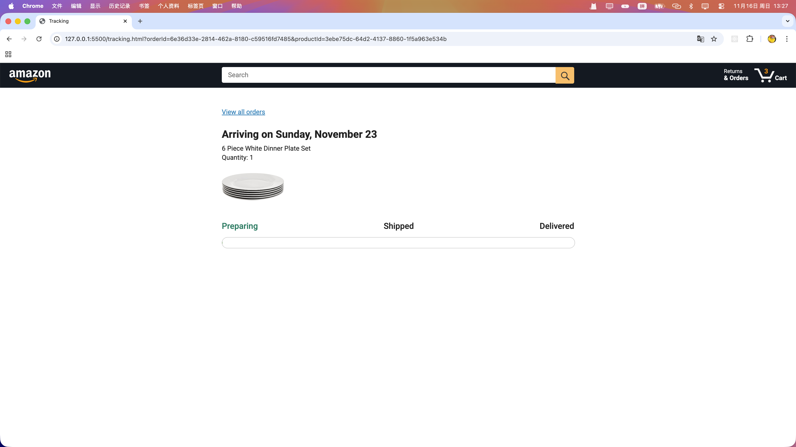

# 🛒 JavaScript Amazon Project（亚马逊电商项目）

这是一个使用原生 JavaScript（零框架）构建的完整电商网站项目，包含商品展示、购物车、结账流程、订单历史、物流追踪、价格计算逻辑、本地后端模拟数据，以及完整 Jasmine 单元测试，是一个综合性极强的前端工程实践项目。

---

## 🧰 技术栈（Tech Stack）

### 🎨 前端（Front-end）
- **HTML5 / CSS3 / 原生 JavaScript**
- 模块化结构（多文件拆分）
- DOM 操作 & 事件处理
- 价格计算逻辑 / 税费系统 / 配送日期算法

### 🗂 数据层（Data Layer）
- 本地 JSON 模拟后端（products.json）
- localStorage 持久化购物车与订单
- 面向对象 + 函数式混合业务逻辑

### 🧪 测试（Testing）
- **Jasmine 5.1.1**
- 单元测试覆盖核心功能：
  - money.js（价格计算）
  - cart.js（购物车）
  - products.js（商品数据）
  - checkout（订单摘要）

---

## 📌 项目结构概览

```
javascript-amazon-project/
│
├── backend/
│   └── products.json
│
├── data/
│   ├── backend-practice.js
│   ├── cart.js
│   ├── cart-class.js
│   ├── cart-oop.js
│   ├── deliveryOptions.js
│   ├── orders.js
│   └── products.js
│
├── images/
│   ├── icons/
│   ├── products/
│   ├── ratings/
│   ├── home.png
│   ├── checkout.png
│   ├── orders.png
│   └── tracking.png
│
├── practice/
│
├── scripts/
│   ├── checkout/
│   │   ├── checkoutHeader.js
│   │   ├── orderSummary.js
│   │   └── paymentSummary.js
│   ├── utils/
│   │   ├── date.js
│   │   ├── money.js
│   │   ├── amazon.js
│   │   ├── checkout.js
│   │   ├── orders.js
│   │   └── tracking.js
│   ├── amazon.js
│   ├── checkout.js
│   ├── orders.js
│   └── tracking.js
│
├── styles/
│   ├── pages/
│   │   └── checkout/
│   │       ├── checkout-header.css
│       │   ├── checkout.css
│       │   ├── amazon.css
│       │   ├── orders.css
│       │   └── tracking.css
│   └── shared/
│       ├── amazon-header.css
│       └── general.css
│
├── tests/
│   ├── checkout/orderSummaryTest.js
│   ├── data/cartTest.js
│   ├── data/productsTest.js
│   ├── utils/moneyTest.js
│   ├── tests-simple/moneyTest.js
│   └── lib/jasmine-5.1.1/
│       ├── boot0.js
│       ├── boot1.js
│       ├── jasmine.js
│       ├── jasmine-html.js
│       ├── jasmine.css
│       └── jasmine_favicon.png
│
├── index.html
├── checkout.html
├── orders.html
├── tracking.html
└── README.md
```

---

## 📷 页面截图展示

### 🏠 首页（Home）


### 🛒 结账页面（Checkout）


### 📦 订单页面（Orders）


### 🚚 物流追踪（Tracking）


---

## 🚀 如何运行项目

本项目为 **纯前端静态项目**，直接打开即可运行：

- `index.html`  
- `checkout.html`  
- `orders.html`  
- `tracking.html`

💡 推荐方式（更方便）  
使用 VSCode **Live Server** → 右键 *Open with Live Server*

---

## 🧠 项目亮点（学习价值）

- 完整电商流程：商品→加购→结账→下单→订单→物流  
- 深入理解购物车、订单、配送逻辑  
- 三种购物车实现：函数式 / 面向对象 / class  
- 持久化 localStorage 管理订单与购物车  
- 模块化 JS 项目结构（专业级拆分）  
- 覆盖率高的 Jasmine 单元测试

---

## 🧪 运行测试（Jasmine）

打开：

```
tests/tests.html
```

浏览器会自动启动测试运行器。

---

## 📄 License
MIT License
